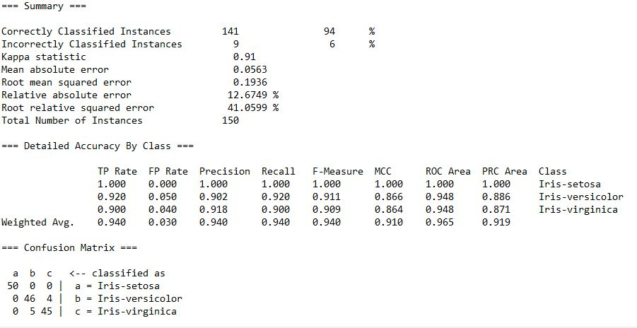

# Classification on Iris flower

This practice is to classify the Iris flower as either setosa, versicolor, or virginica based on its attributes. The machine learning algorithms used are as following:  

# <a href="https://github.com/EeYeoKeat/Data_Mining/blob/master/Using%20Weka%20software/Intro_Classification_Iris%20Flower/Analysis%20Results/Weka%20data%20analysis%20-%20Decision%20Tree.txt">Decision Tree</a>

# Software Tools

<ul>
  <li>Weka 3.8</li>
  <li><a href="http://tunedit.org/repo/UCI/iris.arff">Iris Dataset</a></li>
</ul>
